# JobPilot — Knowledge Transfer Document

> **Purpose:** This document provides a complete technical knowledge transfer for the JobPilot Enterprise AI Job Applicator project. It covers the system architecture, tech stack, data flows, module breakdown, API reference, and operational workflows — with Mermaid diagrams for visual understanding.

---

## Table of Contents

1. [Project Overview](#1-project-overview)
2. [Tech Stack](#2-tech-stack)
3. [Repository Structure](#3-repository-structure)
4. [System Architecture](#4-system-architecture)
5. [Application Workflow](#5-application-workflow)
6. [Module Breakdown](#6-module-breakdown)
   - [app.py — FastAPI Backend](#61-apppy--fastapi-backend)
   - [job_scraper.py — Multi-Source Job Search](#62-job_scraperpy--multi-source-job-search)
   - [ai_engine.py — Claude AI Logic](#63-ai_enginepy--claude-ai-logic)
   - [resume_reader.py — Resume I/O](#64-resume_readerpy--resume-io)
   - [static/js/app.js — Frontend Logic](#65-staticjsappjs--frontend-logic)
7. [API Endpoint Reference](#7-api-endpoint-reference)
8. [Data Flow Diagrams](#8-data-flow-diagrams)
9. [Job Scraping Pipeline](#9-job-scraping-pipeline)
10. [AI Features Deep-Dive](#10-ai-features-deep-dive)
11. [Environment & Configuration](#11-environment--configuration)
12. [Setup & Deployment](#12-setup--deployment)
13. [Troubleshooting Guide](#13-troubleshooting-guide)

---

## 1. Project Overview

**JobPilot** is a full-stack, AI-powered job application assistant that aggregates real job postings from multiple platforms, tailors resumes with Claude AI, scores them against ATS (Applicant Tracking System) criteria, and helps users apply — all from a single web interface.

### Key Capabilities

| Capability | Description |
|---|---|
| **Multi-platform job search** | Searches 6 live APIs simultaneously: JSearch, Adzuna, The Muse, Remotive, USAJobs, Arbeitnow |
| **AI Resume Tailoring** | Claude Sonnet rewrites your resume to match a specific job description |
| **ATS Scoring** | Keyword analysis and category-level scoring against the job description |
| **Resume Generation** | Generate a complete resume from a plain-text description of your background |
| **AI Chat Editor** | Apply natural-language instructions to your resume (e.g., "Make it more concise") |
| **Line-level AI Improvement** | Rewrite any single bullet point with targeted AI suggestions |
| **Certification Suggestions** | Smart recommendations based on role, company, and resume gaps |
| **Screening Q&A** | AI-generated answers to application screening questions |
| **Multi-format Export** | Download tailored resumes as `.pdf`, `.docx`, or `.txt` |

---

## 2. Tech Stack

### Backend

| Layer | Technology | Version | Purpose |
|---|---|---|---|
| **Web Framework** | FastAPI | 0.111.0 | REST API, async request handling, OpenAPI docs |
| **ASGI Server** | Uvicorn | 0.30.1 | Production-grade async server |
| **AI / LLM** | Anthropic Claude (claude-sonnet) | ≥0.40.0 | ATS scoring, tailoring, chat, generation |
| **Web Scraping** | BeautifulSoup4 | 4.12.3 | HTML parsing for job description scraping |
| **HTTP Client** | Requests | 2.32.3 | Calling job board APIs |
| **PDF Reading** | pdfplumber + pypdf | 0.11.0 / 4.2.0 | Extract text from PDF resumes |
| **DOCX Reading** | python-docx | 1.1.2 | Read and write `.docx` resume files |
| **PDF Writing** | ReportLab | ≥4.0.0 | Generate PDF resumes from text |
| **Environment** | python-dotenv | 1.0.1 | `.env` file loading for secrets |
| **XML/HTML** | lxml | 5.3.0 | Fast HTML parsing support for BeautifulSoup |
| **File Upload** | python-multipart | 0.0.9 | FastAPI file upload support |

### Frontend

| Layer | Technology | Purpose |
|---|---|---|
| **UI Framework** | Vanilla HTML5 + CSS3 | No build step required — zero JS framework |
| **Fonts** | Google Fonts (Inter, DM Sans) | Typography |
| **Interactivity** | Vanilla JavaScript (ES2022) | Fetch API, async/await, DOM manipulation |
| **Styling** | Custom CSS (style.css) | Responsive layout, sidebar, panels, cards |

### External APIs

| API | Type | Requires Key | Coverage |
|---|---|---|---|
| **JSearch (RapidAPI)** | Paid (free tier: 200 req/month) | `RAPIDAPI_KEY` | Indeed, LinkedIn, Glassdoor, ZipRecruiter, 200+ platforms |
| **Adzuna** | Free tier (250 req/day) | `ADZUNA_APP_ID` + `ADZUNA_APP_KEY` | US market, SMBs, enterprises |
| **The Muse** | Free, no key | — | Tech & startup culture-focused companies |
| **Remotive** | Free, no key | — | Remote-only job positions |
| **USAJobs** | Free, gov | `USAJOBS_API_KEY` + `USAJOBS_EMAIL` | US federal & government jobs |
| **Arbeitnow** | Free, no key | — | International with US/remote filter |
| **Anthropic Claude** | Paid | `ANTHROPIC_API_KEY` | All AI features |

---

## 3. Repository Structure

```
jobpilot/
├── app.py              ← FastAPI backend entry point (uvicorn target)
├── job_scraper.py      ← Multi-source job aggregation engine
├── ai_engine.py        ← All Claude AI logic (scoring, tailoring, chat, generation)
├── resume_reader.py    ← Resume file I/O: read .docx/.pdf/.txt, write .docx/.pdf
├── requirements.txt    ← Python package dependencies
├── .env                ← API keys and secrets (never committed to git)
├── .gitignore          ← Excludes venv, .env, generated files, logs
├── README.md           ← Quick-start guide
├── KNOWLEDGE_TRANSFER.md ← This document
├── resumes/            ← User's resume files (.docx, .pdf, .txt)
├── generated/          ← AI-tailored resumes saved here after download
├── logs/               ← Error logs
└── static/
    ├── index.html      ← Single-page application shell
    ├── css/
    │   └── style.css   ← All UI styles
    └── js/
        └── app.js      ← All frontend JavaScript logic
```

---

## 4. System Architecture

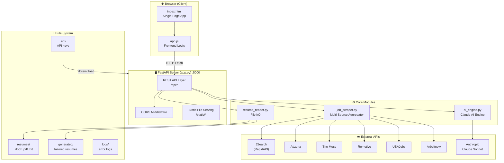

---

## 5. Application Workflow

### End-to-End User Journey

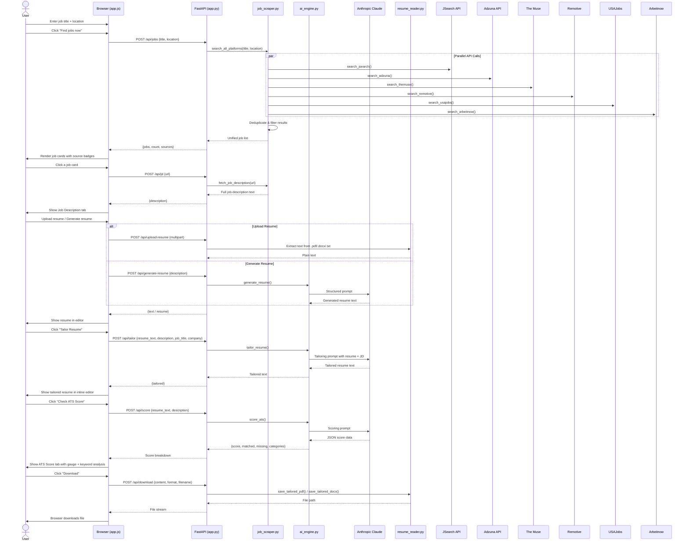

---

## 6. Module Breakdown

### 6.1 `app.py` — FastAPI Backend

The main entry point and API layer. Handles all HTTP routing, request validation, and orchestrates calls to the core modules.

**Key responsibilities:**
- FastAPI application setup with CORS middleware
- Static file serving (`/static/*`)
- In-memory API usage counters (resets on restart)
- Route handlers for all 13 API endpoints
- Pydantic request/response models for type safety

**In-memory state:**
```python
_usage = {
    "jsearch_requests":  0,   # 5 per search, free tier = 200/month
    "adzuna_requests":   0,   # 4 per search, free tier = 250/day
    "claude_calls":      0,   # each tailor/score/chat/generate = 1 call
    "total_searches":    0,
    "total_tailors":     0,
    "total_ats_scores":  0,
    "total_ai_chats":    0,
}
```

**Pydantic models:**

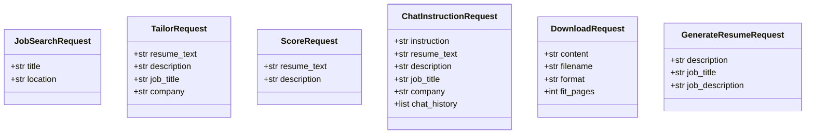

---

### 6.2 `job_scraper.py` — Multi-Source Job Search

Aggregates jobs from 6 APIs, normalises the data, filters for US/remote roles, deduplicates by title+company, and enforces strict title matching.

**Title matching logic (4-layer filter):**

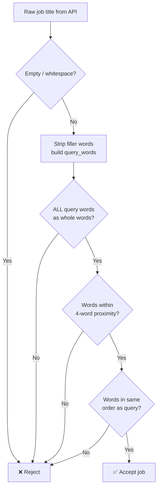

**Source priority & data normalisation:**

Each source function (`search_jsearch`, `search_adzuna`, `search_themuse`, etc.) returns a list of job dicts with a unified schema:

```python
{
    "id":          str,    # unique identifier
    "title":       str,    # normalised job title
    "company":     str,    # company name
    "location":    str,    # normalised location string
    "salary":      str,    # formatted salary range or ""
    "posted":      str,    # normalised relative date ("2 days ago")
    "url":         str,    # direct application link
    "description": str,    # snippet or full JD (if available)
    "source":      str,    # "JSearch" | "Adzuna" | "The Muse" | etc.
}
```

**Deduplication:** Jobs are deduplicated using a set of `"<lowercase title>|<lowercase company>"` composite keys. First occurrence wins.

---

### 6.3 `ai_engine.py` — Claude AI Logic

All AI interactions with Anthropic's Claude Sonnet model. Uses a single reusable `_call()` helper for text responses and `_call_json()` for structured JSON output.

**Function summary:**

| Function | Input | Output | Claude tokens (approx.) |
|---|---|---|---|
| `score_ats()` | resume text + JD | JSON: score, categories, keywords | ~800 |
| `tailor_resume()` | resume + JD + title + company | Tailored resume text | ~2000 |
| `improve_line()` | single bullet + JD + title | Improved bullet text | ~300 |
| `apply_chat_instruction()` | instruction + resume + history | Updated resume + explanation | ~2000 |
| `suggest_certifications()` | resume + JD + title + company | List of certs with rationale | ~800 |
| `answer_screening_question()` | question + resume + JD | Answer string | ~500 |
| `generate_resume()` | free-text user description | Full formatted resume | ~2000 |

**ATS score structure:**

```json
{
  "score": 78,
  "matched_keywords": ["Python", "Spark", "ETL"],
  "missing_keywords": ["Airflow", "dbt"],
  "categories": {
    "skills_match":    85,
    "experience":      75,
    "education":       90,
    "formatting":      70,
    "keyword_density": 80
  },
  "summary": "Strong technical match. Add Airflow and dbt experience."
}
```

---

### 6.4 `resume_reader.py` — Resume I/O

Handles reading resume files from disk and writing tailored resumes in multiple formats.

**Read functions:**
- `get_resume_list()` — scan `resumes/` directory, return file metadata
- `read_resume(filename)` — dispatch to correct reader by extension

**Write functions:**
- `save_tailored_resume(filename, text)` — plain `.txt` to `generated/`
- `save_tailored_docx(filename, text)` — `.docx` with formatted sections
- `save_tailored_pdf(filename, text, max_pages)` — PDF via ReportLab, optional page fitting

**Format support matrix:**

| Format | Read | Write |
|--------|------|-------|
| `.txt` | ✅ | ✅ |
| `.docx`| ✅ | ✅ |
| `.pdf` | ✅ (pypdf + pdfplumber) | ✅ (ReportLab) |

---

### 6.5 `static/js/app.js` — Frontend Logic

A single-file vanilla JavaScript application (~1300 lines) that drives the entire UI. No framework, no build step — just ES2022 running in the browser.

**Global state:**
```javascript
let allJobs     = [];        // full job list from last search
let selectedJob = null;      // currently open job
let jobStates   = {};        // per-job state keyed by job ID
let currentTab  = "jd";     // active right-panel tab
```

**Per-job state object (`jobStates[id]`):**
```javascript
{
  state:        "idle" | "loading" | "tailored",
  resumeText:   string,   // extracted resume content
  resumeName:   string,   // display name
  jdText:       string,   // job description text
  tailoredText: string,   // AI-tailored resume
  score:        number,   // ATS score 0–100
  scoreData:    object,   // full score breakdown
  chatHistory:  array,    // AI chat conversation history
}
```

**Right panel tabs:**

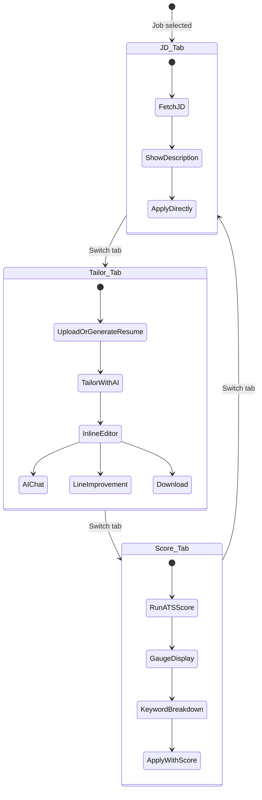

---

## 7. API Endpoint Reference

All endpoints are served at `http://localhost:5000`. Full interactive docs available at `/docs` (Swagger UI).

| Method | Path | Request Body | Response | Description |
|--------|------|-------------|----------|-------------|
| `GET` | `/` | — | HTML | Serves `index.html` |
| `GET` | `/api/health` | — | `{status, api_key_set, resume_count, sources}` | Health check |
| `GET` | `/api/usage` | — | `{usage, limits}` | API usage counters |
| `POST` | `/api/jobs` | `{title, location}` | `{jobs[], count, sources[]}` | Search all job platforms |
| `POST` | `/api/jd` | `{url, description}` | `{description}` | Fetch/pass-through job description |
| `POST` | `/api/upload-resume` | `multipart/form-data` | `{text, filename}` | Extract text from uploaded resume |
| `POST` | `/api/generate-resume` | `{description, job_title, job_description}` | `{resume}` | AI-generate full resume |
| `POST` | `/api/score` | `{resume_text, description}` | ATS score JSON | Score resume vs. job description |
| `POST` | `/api/tailor` | `{resume_text, description, job_title, company}` | `{tailored}` | AI-tailor resume for job |
| `POST` | `/api/improve-line` | `{line, description, job_title}` | `{improved}` | AI-improve a single bullet |
| `POST` | `/api/chat-instruction` | `{instruction, resume_text, description, job_title, company, chat_history}` | `{updated_resume, explanation, resume_changed}` | Free-form AI chat edit |
| `POST` | `/api/suggest-certs` | `{resume_text, description, job_title, company}` | Certification suggestions | Smart cert recommendations |
| `POST` | `/api/answer` | `{question, resume_text, description}` | `{answer}` | Answer a screening question |
| `POST` | `/api/download` | `{content, filename, format, fit_pages}` | File stream | Download resume as .pdf/.docx/.txt |

---

## 8. Data Flow Diagrams

### Resume Tailoring Flow

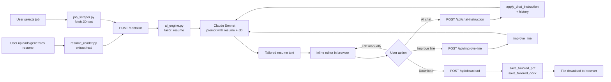

### ATS Scoring Flow

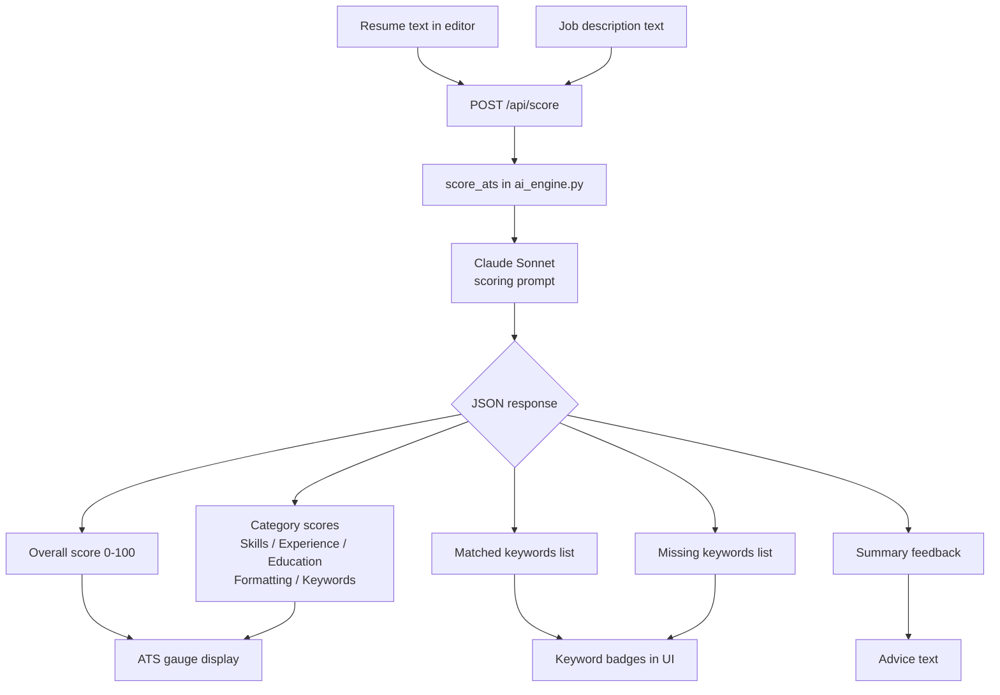

---

## 9. Job Scraping Pipeline

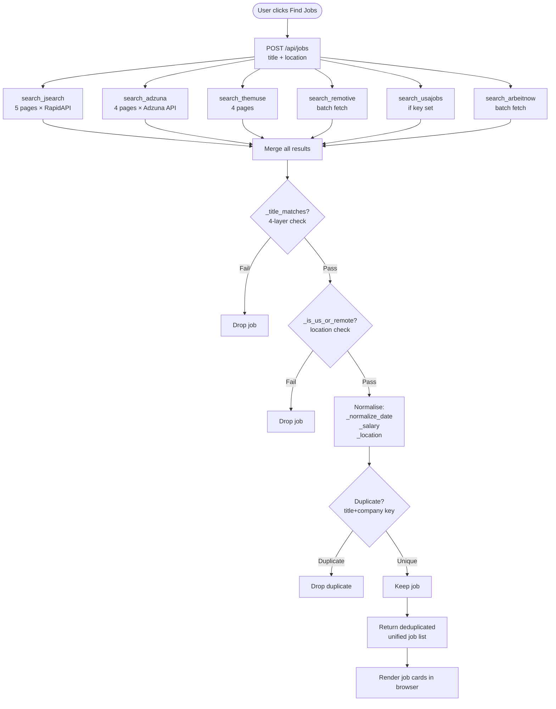

---

## 10. AI Features Deep-Dive

### Claude Prompt Architecture

All Claude calls follow the same pattern in `ai_engine.py`:

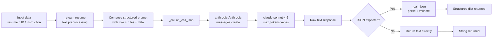

### AI Chat with History

The `/api/chat-instruction` endpoint maintains full conversation history, enabling multi-turn editing sessions:

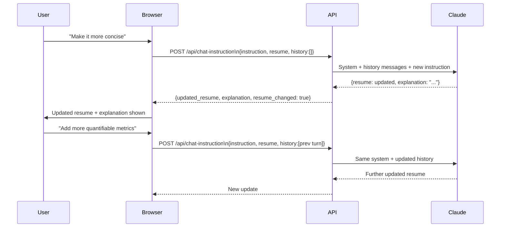

---

## 11. Environment & Configuration

### Required `.env` Variables

```env
# Required for all AI features
ANTHROPIC_API_KEY=sk-ant-...

# Optional — for JSearch (RapidAPI) coverage (free: 200 req/month)
RAPIDAPI_KEY=...

# Optional — for Adzuna coverage (free: 250 req/day)
ADZUNA_APP_ID=...
ADZUNA_APP_KEY=...

# Optional — for US government jobs
USAJOBS_API_KEY=...
USAJOBS_EMAIL=your@email.com
```

### Free vs. Keyed Sources

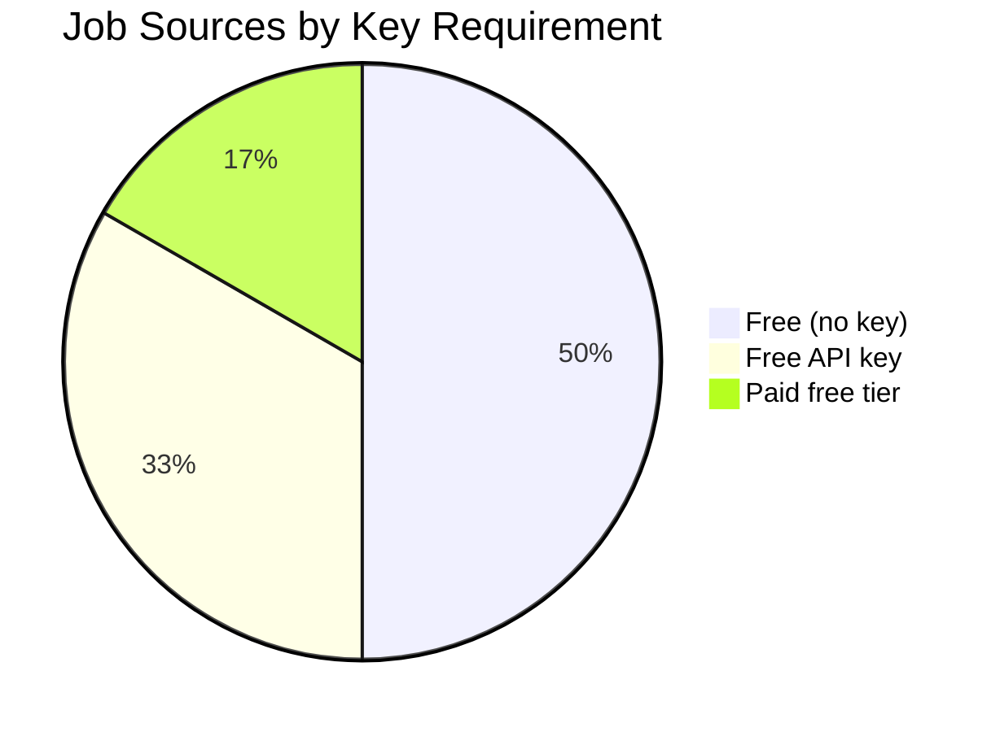

| Source | Always Active | Key Required | Free Tier Limit |
|--------|:---:|:---:|---|
| The Muse | ✅ | ❌ | Unlimited |
| Remotive | ✅ | ❌ | Unlimited |
| Arbeitnow | ✅ | ❌ | Unlimited |
| Adzuna | ⚡ | ✅ | 250 requests/day |
| USAJobs | ⚡ | ✅ | Unlimited (gov) |
| JSearch | ⚡ | ✅ | 200 requests/month |

### API Usage Counters

The server tracks usage in-memory via `_usage` dict (resets on restart). View live at `GET /api/usage`.

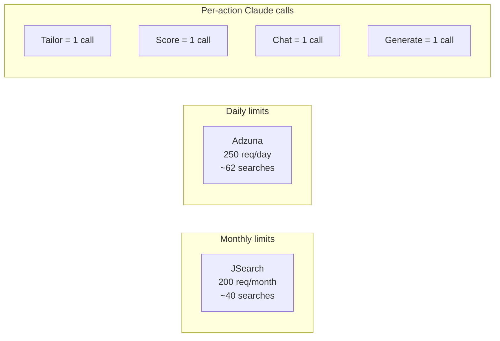

---

## 12. Setup & Deployment

### Development Setup

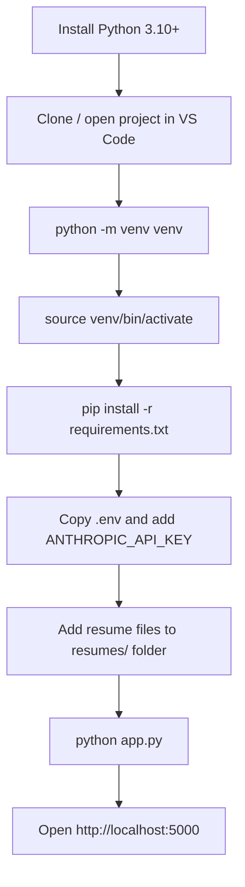

### Running the Server

```bash
# Development (with auto-reload)
python app.py

# Or directly with uvicorn
uvicorn app:app --reload --port 5000

# Production (no reload, multiple workers)
uvicorn app:app --host 0.0.0.0 --port 5000 --workers 4
```

### Key URLs

| URL | Purpose |
|-----|---------|
| `http://localhost:5000` | Main application UI |
| `http://localhost:5000/docs` | Swagger / OpenAPI interactive docs |
| `http://localhost:5000/redoc` | ReDoc API documentation |
| `http://localhost:5000/api/health` | Health check endpoint |
| `http://localhost:5000/api/usage` | API usage counters |

### Dependency Graph

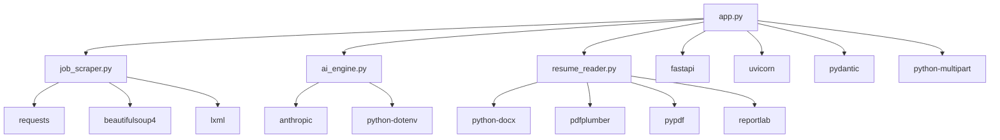

---

## 13. Troubleshooting Guide

### Common Issues

| Problem | Likely Cause | Solution |
|---|---|---|
| `ANTHROPIC_API_KEY not set` | Missing env var | Add key to `.env` file |
| `No resumes found` | Empty `resumes/` folder | Copy `.docx` or `.txt` files there |
| Jobs not loading | API key missing or platform blocking | Check `.env` for `RAPIDAPI_KEY` / `ADZUNA_APP_ID`; retry without VPN |
| Download fails | `python-docx` or `reportlab` not installed | `pip install -r requirements.txt` |
| Port 5000 in use | Another process on the port | Change port: `uvicorn app:app --port 5001` |
| PDF text extraction empty | Scanned/image PDF | Convert to `.txt` first — Claude reads text only |
| ATS score always low | Resume format issues | Use `.txt` or `.docx`; avoid heavy formatting |
| JSearch quota exceeded | 200 req/month limit hit | Adzuna + free sources still work; or upgrade plan |

### Debugging Tips

1. **Server console** — All scraper errors and API failures print to stdout with `[scraper]` prefix.
2. **Browser DevTools** — Open Network tab to inspect API call payloads and responses.
3. **`/api/usage`** — Check API usage counters to diagnose quota issues.
4. **`/api/health`** — Verify which API keys are loaded and how many resumes are detected.
5. **Logs folder** — Check `logs/` directory for persistent error logs.

### VPN & IP Blocking

Some job platforms (LinkedIn, Indeed) detect and block datacenter IP addresses. If running on a cloud VM or behind a VPN:
- The Muse, Remotive, Arbeitnow, USAJobs are **not** affected (API-based).
- JSearch and Adzuna go through RapidAPI infrastructure — usually not affected.
- Direct HTML scraping (used by `fetch_job_description`) may fail — the UI falls back to a "copy-paste" prompt gracefully.

---

*Document generated: 2026-04-08 | JobPilot Enterprise v3.0*
